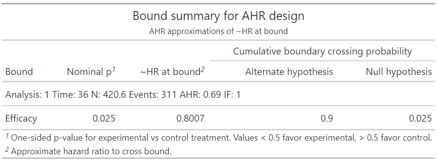

# gsDesign2

<!-- badges: start -->
[](https://github.com/LittleBeannie/gsDesign2/actions/workflows/R-CMD-check.yaml)
[](https://CRAN.R-project.org/package=gsDesign2)
<!-- badges: end -->

## Objective
The goal of **gsDesign2** is to enable fixed or group sequential design under non-proportional hazards. Piecewise constant enrollment, failure rates and dropout rates for a stratified population are available to enable highly flexible enrollment, time-to-event and time-to-dropout assumptions. Substantial flexibility on top of what is in the gsDesign package is intended for selecting boundaries. While this work is in progress, substantial capabilities have been enabled. Comments on usability and features are encouraged as this is a development version of the package.

The goal of **gsDesign2** is to enable group sequential trial design for time-to-event endpoints under non-proportional hazards assumptions. The package is still maturing; as the package functions become more stable, they will likely be included in the **gsDesign2** package.

## Installation

You can install `gsDesign2` with:

``` r
remotes::install_github("LittleBeannie/gsDesign2")
```
## Use cases

### Step 1: specifying enrollment and failure rates

This is a basic example which shows you how to solve a common problem.
We assume there is a 4 month delay in treatment effect. Specifically, we
assume a hazard ratio of 1 for 4 months and 0.6 thereafter. For this
example we assume an exponential failure rate and low exponential
dropout rate. The `enrollRates` specification indicates an expected
enrollment duration of 12 months with exponential inter-arrival times.

``` r
library(gsDesign)
library(gsDesign2)
library(dplyr)
library(gt)

## basic example code

## Constant enrollment over 12 months
## rate will be adjusted later by gsDesignNPH to get sample size
enrollRates <- tibble::tibble(Stratum = "All", duration = 12, rate = 1)

## 12 month median exponential failure rate in control
## 4 month delay in effect with HR=0.6 after
## Low exponential dropout rate
medianSurv <- 12
failRates <- tibble::tibble(
  Stratum = "All",
  duration = c(4, Inf),
  failRate = log(2) / medianSurv,
  hr = c(1, .6),
  dropoutRate = .001)
```

The resulting failure rate specification is the following table. As many
rows and strata as needed can be specified to approximate whatever
patterns you wish.

``` r
failRates %>% gt()
```

| Stratum | duration |  failRate |  hr | dropoutRate |
|:--------|---------:|----------:|----:|------------:|
| All     |        4 | 0.0577623 | 1.0 |       0.001 |
| All     |      Inf | 0.0577623 | 0.6 |       0.001 |

### Step 2: compute the design 

Computing a fixed sample size design with 2.5% one-sided Type I error
and 90% power. We specify a trial duration of 36 months with
`analysisTimes`. Since there is a single analysis, we specify an upper
p-value bound of 0.025 with `upar = qnorm(0.975)`. There is no lower
bound which is specified with `lpar = -Inf`.

``` r
x <- gs_design_ahr(enrollRates, failRates, 
                   upper = gs_b, upar = qnorm(.975), 
                   lower = gs_b, lpar = -Inf, 
                   IF = 1, analysisTimes = 36)
```

The input enrollment rates are scaled to achieve power:

``` r
x$enrollRates %>% gt()
```

| Stratum | duration |     rate |
|:--------|---------:|---------:|
| All     |       12 | 35.05288 |

The failure and dropout rates remain unchanged from what was input:

``` r
x$failRates %>% gt()
```

| Stratum | duration |  failRate |  hr | dropoutRate |
|:--------|---------:|----------:|----:|------------:|
| All     |        4 | 0.0577623 | 1.0 |       0.001 |
| All     |      Inf | 0.0577623 | 0.6 |       0.001 |


Additionally, the summary of bounds and crossing probability is
available at 

``` r
x$bounds %>% gt()
```

| Analysis | Bound | Probability | Probability0 |   Z      | ~HR at bound | Nominal p |
|---------:|:------|------------:|-------------:|---------:|-------------:|----------:|
|        1 | Upper |     0.9     |   0.025      |  1.96    |    0.801     |   0.025   |     

Finally, the expected analysis time is in `Time`, sample size `N`,
events required `Events` and average hazard ratio `AHR` are in `x$analysis`. 
Note that `AHR` is the average hazard ratio used to calculate the targeted event
counts. The natural parameter (`log(AHR)`) is in theta and corresponding
statistical information under the alternate hypothesis are in `info` and
under the null hypothesis in `info0`.

``` r
x$analysis %>% gt()
```

| Analysis | Time |  N   | Events  |  AHR  | theta | info | info0 |  IF | 
|---------:|:-----|-----:|--------:|------:|------:|-----:|------:|----:|
|        1 |  36  | 421  |  311    | 0.692 | 0.369 | 76.7 | 77.8  |  1  |

### Step 3: summarize the design

``` r
x %>% summary() %>% as_gt()
```


